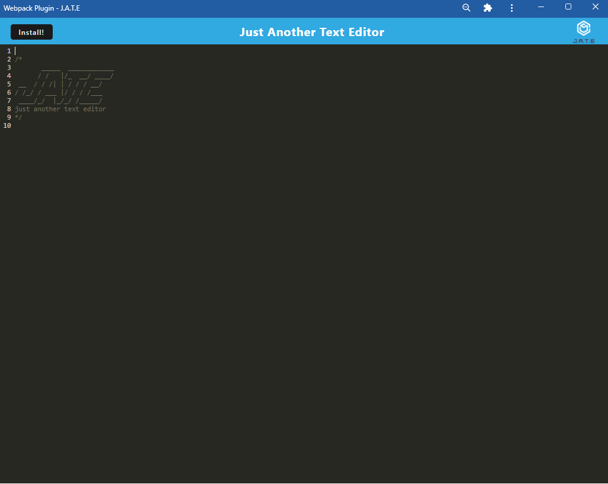

# Text Editor

# Description

In this challenge we were given a finished text editor application and we had to work on the package.json file and update the scripts, and the dependencies. Also, inside the client folder, we had to update the webpack.config.js and add the HtmlWebpackPlugin, CSS loaders and Babel. I also updated the service worker, and lastly, inside the js folder, I updated the buttons event listeners, and the functions inside the database.js 

# Table of Contents

- [Installation](#installation)
- [Usage](#usage)
- [Credits](#credits)
- [Questions](#questions)
- [License](#license)

# Installation
After adding webpack and babel in my package.json I did an npm i

# Usage

[Click here to go to the deployed url](https://text-editor-gina.herokuapp.com/)

# Credits
- 
- 

# Questions
Link to my github profile [Github](https://github.com/ginitadavis/)
If you have any questions, you can reach me via email at gina.vera.davis@gmail.com

# License

            MIT License
Copyright (c) 2013 Mark Otto.
Copyright (c) 2017 Andrew Fong.
Permission is hereby granted, free of charge, to any person obtaining a copy of this software and associated documentation files (the "Software"), to deal in the Software without restriction, including without limitation the rights to use, copy, modify, merge, publish, distribute, sublicense, and/or sell copies of the Software, and to permit persons to whom the Software is furnished to do so, subject to the following conditions:
The above copyright notice and this permission notice shall be included in all copies or substantial portions of the Software.
THE SOFTWARE IS PROVIDED "AS IS", WITHOUT WARRANTY OF ANY KIND, EXPRESS OR IMPLIED, INCLUDING BUT NOT LIMITED TO THE WARRANTIES OF MERCHANTABILITY, FITNESS FOR A PARTICULAR PURPOSE AND NONINFRINGEMENT. IN NO EVENT SHALL THE AUTHORS OR COPYRIGHT HOLDERS BE LIABLE FOR ANY CLAIM, DAMAGES OR OTHER LIABILITY, WHETHER IN AN ACTION OF CONTRACT, TORT OR OTHERWISE, ARISING FROM, OUT OF OR IN CONNECTION WITH THE SOFTWARE OR THE USE OR OTHER DEALINGS IN THE SOFTWARE.
